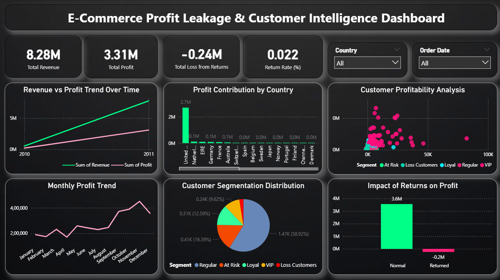

# 📊 E-Commerce Profit Leakage & Customer Intelligence Dashboard

## 🚀 Project Overview

This project analyzes e-commerce transactional data to identify **profit leakage caused by returns, low-margin products, and customer behavior**. The goal is to transform raw data into actionable business insights using a complete BI pipeline.

---

## 🎯 Business Problem

Companies generate high revenue but still face **profit loss due to returns, discounts, and unprofitable customers**. This project aims to detect those issues and provide strategic recommendations.

---

## 🛠️ Tools & Technologies

* Python (Pandas, NumPy)
* SQL (Data Analysis)
* Power BI (Dashboard & Visualization)

---

## 📂 Project Structure

* `data/` → Cleaned datasets
* `dashboard/` → Power BI dashboard
* `notebooks/` → Data cleaning & analysis
* `images/` → Dashboard screenshots

---

## 📊 Dashboard Preview

---

## 📈 Key Insights

* Significant profit loss due to product returns
* Top 10 products contribute major losses
* VIP customers generate majority of profit
* Certain customer segments negatively impact margins

---

## 💡 Business Recommendations

* Reduce returns from high-risk customers
* Optimize pricing strategy for loss-making products
* Focus marketing on high-value (VIP) customers
* Improve return and refund policies

---

## 📌 Outcome

Built a **business intelligence system** that helps stakeholders identify profit leakage and improve decision-making.

---

## 👨‍💻 Author

Samudrala Vijayendra Varma
